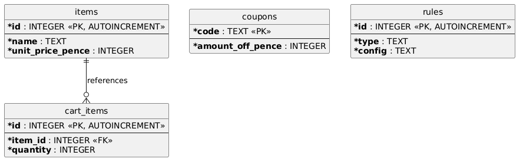

# Pricing & Discount Engine

A small full-stack cart pricing app: Node.js/Express API, SQLite, React (Vite) frontend.

## Running it

```
docker compose up --build
```

- API: http://localhost:4000
- UI: http://localhost:5173

The database is a SQLite file in a Docker volume, seeded automatically on first boot
(see `backend/src/db.js`) with a sample cart, a couple of coupon codes (`SAVE5`, `WELCOME10`),
one BXGY rule (buy 3 USB-C Cables, get 1 free), and one percentage rule (10% off carts over £50).

Running without Docker: `cd backend && npm install && npm run dev`, then
`cd frontend && npm install && npm run dev`.

To refresh the environment do 'docker compose down -v' to remove the current data.

## Database

Rules live in a single `rules` table with a `type` column and JSON `config` payload,
so adding a new rule type only needs a new branch in `pricing.js` and a new row shape
without a new table or migration.



## Current discount ordering

1. BOGOF first as it changes how many units are actually being paid for, which everything
   else should be calculated from.
2. Percentage off coupons.
3. Flat coupon last, off whatever's left.
4. Clamp at £0 so coupons or discounts can't push the total negative.


## Planned

- Go through and double check AI generated dependency versions.

## AI-tool notes

- Generated initial project structure and dockerfiles, but in the backend it used an image base that's securty was expired, so I needed to change that. In the initial files it also made a slightly weird database design where each rule would get its own table, I then go it to go back and change that to the current system of a rules table with json.
- Got it to update the README after making changes
- Used AI to generate the initial unit test system
- Used AI to add the API authentication based on how I previously implemented them in a prev. project. This is a basic implementation as it currently doesnt allow you to update your cart ect when logged out, on a real system you'd most likely want people to be able to checkout as a guest but this is just showing how it can work. To add authentication to an endpoint you just need to add 'requireSession' to it.